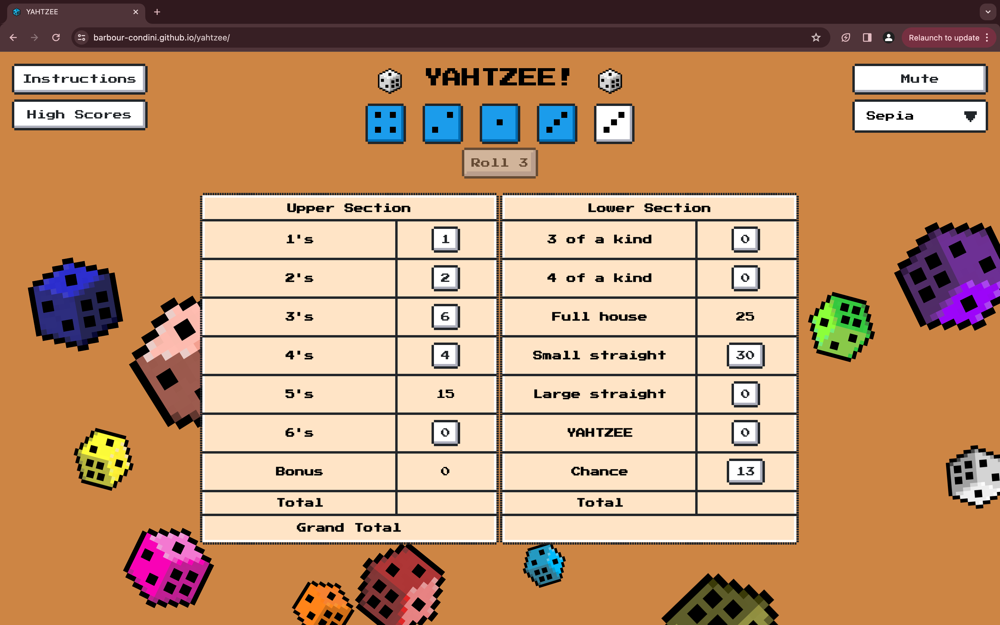

# Yahtzee!

## Contents
- [About](#about)
- [Setup guide](#setup-guide)
- [Roadmap](#roadmap)
- [Acknowledgements](#acknowledgements)
- [Licenses](#licenses)

## About
An in-browser Yahtzee simulator. Not optimised for mobile.

## Setup guide

None required; clone the repo to run locally and/or edit. 

If you just want to play the game online, head to [barbour-condini.github.io/yahtzee/](https://barbour-condini.github.io/yahtzee/) 

## Acknowledgements
With thanks to:
- [NES.css](https://nostalgic-css.github.io/NES.css/) (CSS framework)
- [ZapSplat.com](https://www.zapsplat.com) (sound effects)
- [Pixilart.com](https://www.pixilart.com) (pixel art software)

## Licenses
This project is licensed under the terms of the [MIT license](https://opensource.org/license/mit/)
